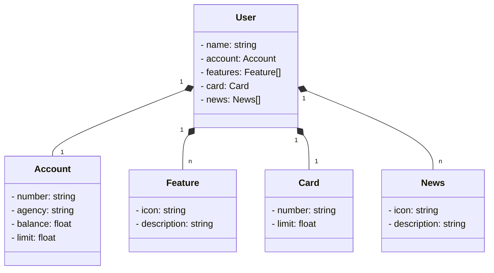

# Santander Bank App

👋 Welcome to the Santander Bank App project, designed to provide a seamless and modern banking experience!

## Project Description

📦 This project includes an API that connects the frontend to the backend and the database to access and manipulate user data. The data structure comprises user information, account details, features, card information, and news updates.

## Dependencies

🔨 The project relies on the following dependencies:

- [Frontend Framework]: Specify the frontend framework or library used (e.g., Angular).
- [Backend Framework]: Specify the backend framework for the API (e.g., Express, Django, Flask).
- [Database]: Describe the database technology for storing user data (e.g., MySQL, PostgreSQL).

## Class diagram

## Key Features

🚀 Explore the features of our Santander Bank App project:

- 👤 **User**: Contains user-related information.
- 💼 **Account**: Includes account details.
- 🌟 **Features**: Describes additional features.
- 💳 **Card**: Contains card information.
- 📰 **News**: Displays news and updates.
